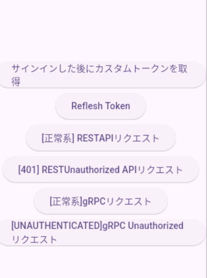

### frontendで firebase の環境構築を行う
ちなみに ビルドはAndroid emulaterを想定
bundle id は com.example.frontend 

###  frontend と backend の
.env.example を .envに変え適切な値を代入


### backend

set up server
```sh
$ cd backend
$ go run cmd/main.go
```

### frontend
```sh
$ cd frontend
$ flutter run
```


1. 認証 → CustomTokenをbackendから受け取り保存するまでの流れ
2. Reflesh Tokenの活用 
3. 正常系 APIリクエスト
4. Tokenが無効の場合のAPIリクエスト

### 対応
REST/gRPC

